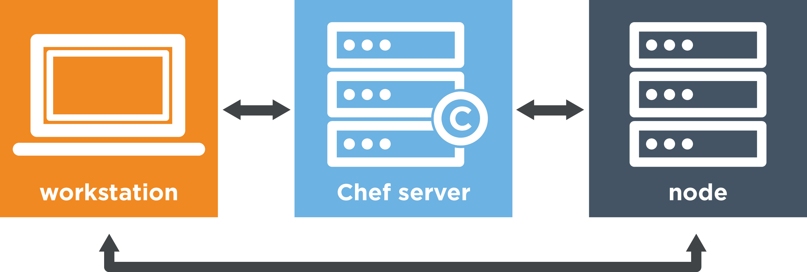

# Oscar The Chef

My Chef Vagrant environment (uses one node)

* Your workstation is the computer from which you author your cookbooks and administer your network. It's typically the machine you use everyday. Although you'll be configuring Ubuntu, your workstation can be any OS you choose – be it Linux, macOS, or Windows.

* Your Chef server acts as a central repository for your cookbooks as well as for information about every node it manages. For example, the Chef server knows a node's fully qualified domain name (FQDN) and its platform.

* A node is any computer that is managed by a Chef server. Every node has the Chef client installed on it. The Chef client talks to the Chef server. A node can be any physical or virtual machine in your network.
## Getting Started
To get started, first bring up the Vagrant environment by executing the following

`$ vagrant up

The Vagrantfile contains two provisioning scripts, one for the Chef Server and one for the Node server.  

**The Server Script**

This script does the following
* Peform updates to the Linux box
* Sync time
* Download the Chef Server version indicated in the script
* Install Chef Server
* Create an admin user (this is helpful for when you sign into the web management console)
* Ensures services are up and running
* Copy the private key to the chef server

**Testing install**
more soon..